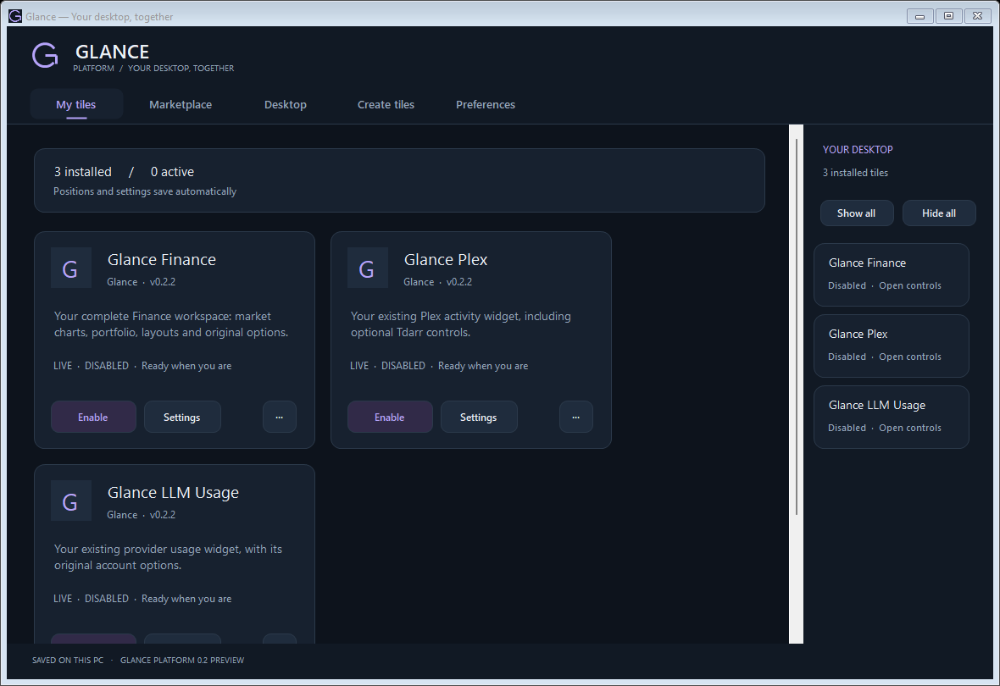
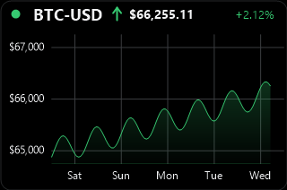
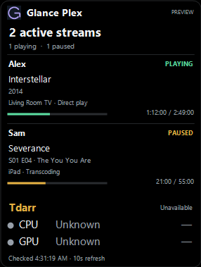

# Glance Platform

One manager for clean, movable desktop tiles.

**[Download the Windows preview](https://github.com/Brusko25/Glance-Platform-Releases/releases/tag/v0.2.2)** · [User guide](USER_GUIDE.md) · [Release notes](CHANGELOG.md)

Glance Platform brings Finance, LLM Usage and Plex into a shared desktop tile system. Tiles keep their original options and run independently. The manager handles installation, placement, the tray and a local Marketplace.

## Get started

1. Download Glance-Platform-0.2.2-Windows.zip from the release page.
2. Extract the entire folder.
3. Run Start Glance.cmd for your normal workspace, or Try Glance.cmd for sample tiles.

Requires Windows 10/11 and .NET Framework 4.8. This unsigned preview is portable; no installer is included.

## Included

| Tile | Based on |
| --- | --- |
| Finance | Glance Finance 2.6.4 |
| LLM Usage | Glance LLM Usage 2.1.1 |
| Plex | Glance Plex 2.2.1 |
| Clock and Notes | SDK examples |

All three converted tile packages are version 0.2.2. The release includes their .glancetile files, a creator kit in the Windows ZIP, and SHA-256 checksums.

Settings opens each tile's familiar options. Minimize tucks the manager into the tray beside the clock. Your account connections and saved tile data stay on your PC.

Marketplace currently browses bundled tiles and a local catalog. Public submissions and online tile hosting are planned. This repository hosts public documentation and release downloads; application implementation is maintained separately.

## Preview images

The images below show synthetic test data from version 0.2.2.

