# Glance Platform

One manager for clean, movable desktop tiles.

**[Download Glance Platform 1.4.2](https://github.com/Brusko25/Glance-Platform-Releases/releases/tag/v1.4.2)** · [User guide](USER_GUIDE.md) · [Release notes](CHANGELOG.md)

Glance Platform brings Finance, LLM Usage, Plex, Investments, Weather, Clock and Notes into a shared desktop tile system. Tiles have matching options and right-click menus and run independently. The manager handles installation, placement, the tray and a local Marketplace.

## Get started

1. Download **Glance-Platform-1.4.2-Setup.exe** from the release page. If Glance is running, choose Quit Glance before running Setup.
2. Run setup to install Glance for your Windows account, with a Start menu entry and an optional desktop shortcut.
3. If Windows asks for administrator permission for the bundled CPU sensor, approve it to show CPU temperature in Plex. Glance installs either way, and you can add the sensor later with Preferences → Repair CPU temperature.
4. Open Glance from the Start menu or its shortcut and install the tiles you want from Marketplace.

Prefer a portable copy? Download the Windows ZIP, extract the entire folder, and run Start Glance.cmd. Try Glance.cmd opens sample tiles in a separate workspace.

Requires Windows 10/11 and .NET Framework 4.8. The installer and portable ZIP are unsigned. Setup registers Glance in Windows Installed apps / Add or remove programs; uninstall keeps your saved tile data.

## Included

| Tile | Based on |
| --- | --- |
| Finance | Glance Finance 2.6.6 |
| LLM Usage | Glance LLM Usage 2.2.1 |
| Plex | Glance Plex 2.3.0 |
| Investments | Webull sync, optional Plaid Voya sync and manual retirement balances |
| Local Weather | Worldwide city or postal-code search, current conditions and a 10-day forecast |
| Clock and Notes | Local time and a saved scratchpad |

Finance, LLM Usage, Clock and Notes are version 1.4.0; Plex is version 1.4.1; Investments and Weather are version 1.1.2. The installer and Windows ZIP include all seven tile packages. Separate Finance, Usage and Plex packages, a creator kit in the ZIP, and SHA-256 checksums are also provided.

**Preferences → Platform updates** checks GitHub for the main app. **My tiles → Update all installed tiles** installs newer bundled or local catalog packages while preserving settings and positions. Platform updates refresh existing Glance shortcut icons and apply newer bundled tiles when their automatic-update preference is enabled.

Every bundled tile has a 75%–200% scale slider in its options. Plex reads CPU temperature through the included sensor component without a separate monitoring app, showing Celsius to the left of Fahrenheit. Windows administrator permission is required to set up that component; readings depend on CPU support.

**Options → Style** offers Compact and Classic layouts, background colours, borders and corner shapes. Preview your choices, then apply them to one tile or all installed tiles. Accounts, notes, locations and desktop positions stay unchanged. Shared Desktop controls and tile-specific tabs follow the Finance options layout. Minimize tucks the manager into the tray beside the clock. Your account connections and saved tile data stay on your PC.

Investments requires your own approved Webull API access for Webull syncing. Voya can be entered manually or connected through your own Plaid Investments account where supported; Plaid availability, eligibility and charges depend on your account and institution. No brokerage or Plaid credentials are included.

## Create tiles with AI

Describe the tile you want in **Create tiles → Create with AI** and choose **Copy AI prompt**. Paste it into any AI chat, such as ChatGPT, Claude or Gemini; the prompt tells the AI everything it needs about Glance tiles. Then choose **Build from AI reply…** and paste the answer. Glance compiles it on your PC, checks it and adds it to your Marketplace, where you review what it can access before installing. If the build fails, one click copies the errors back for the AI to fix. AI-written tiles run with your Windows account's access, like any tile.

Marketplace currently browses bundled tiles and a local catalog. Public submissions and online tile hosting are planned. This repository hosts public documentation and release downloads; application implementation is maintained separately.

## Screenshots

The images below show synthetic test data from version 1.4.2.

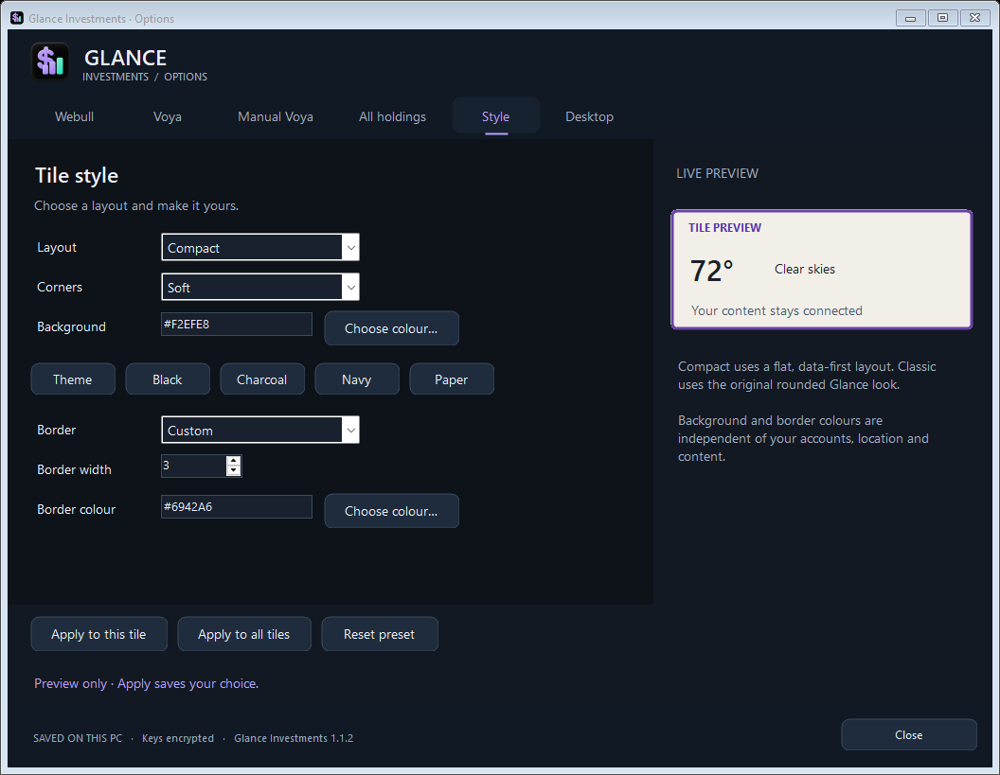
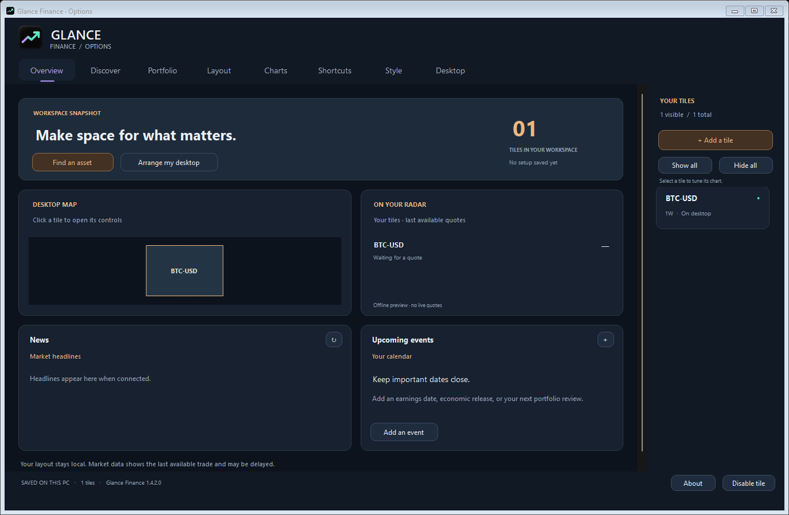

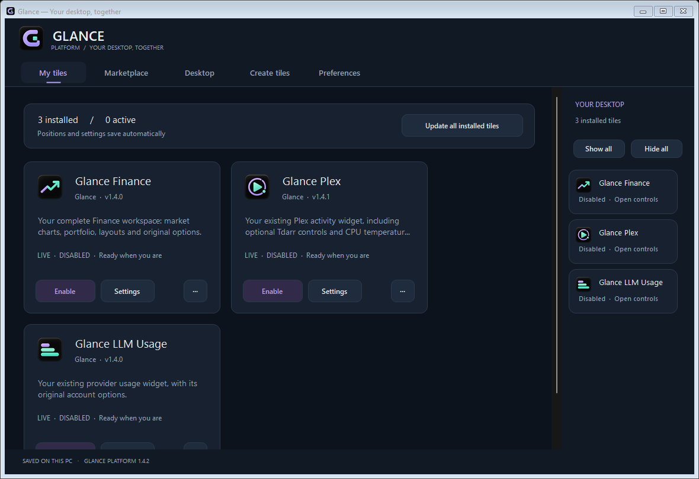
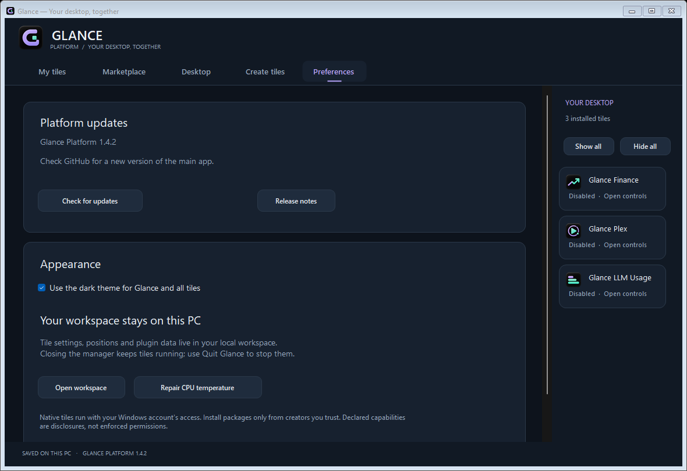

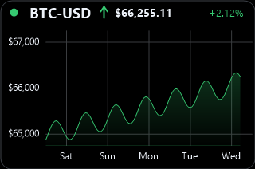
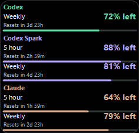
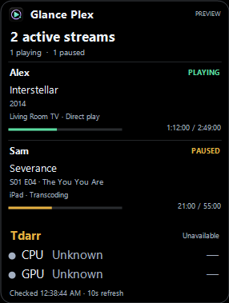
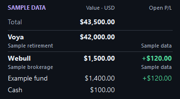
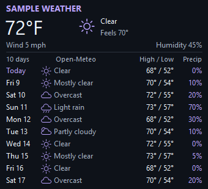

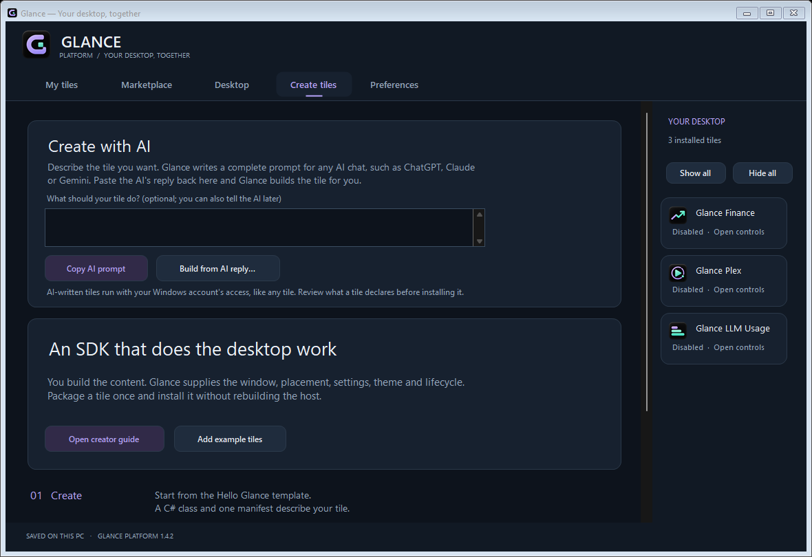
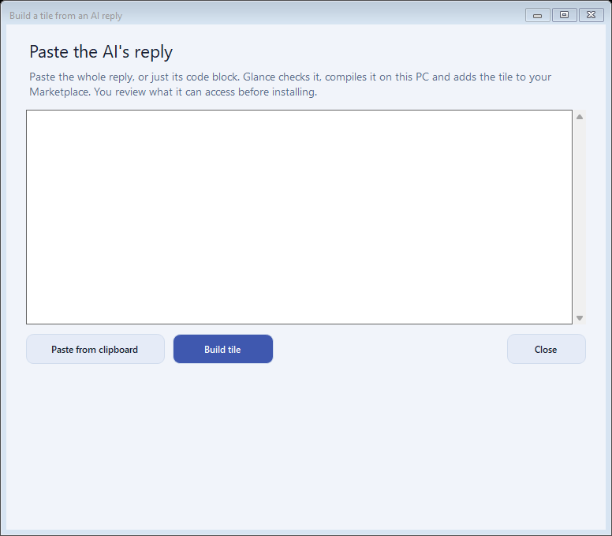
