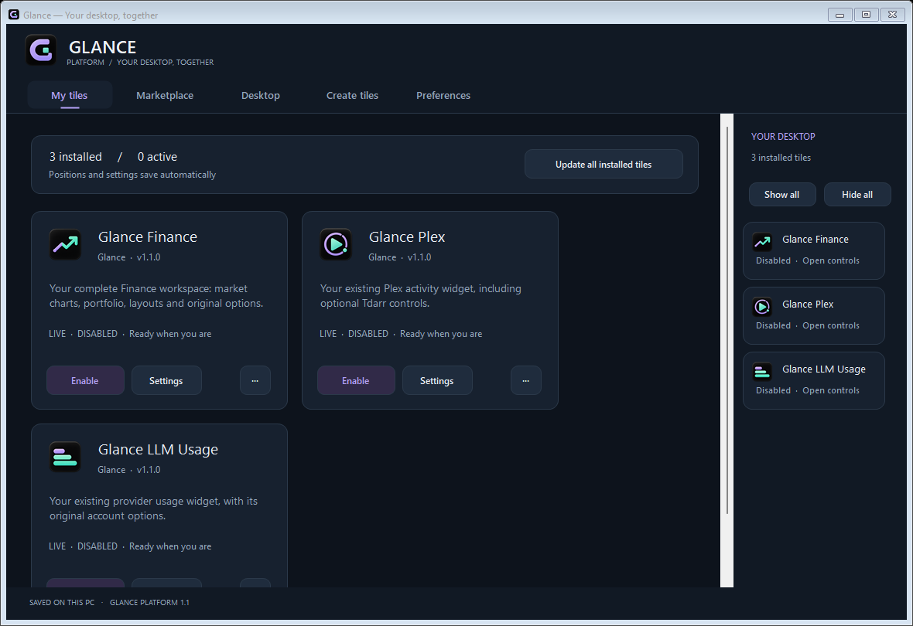
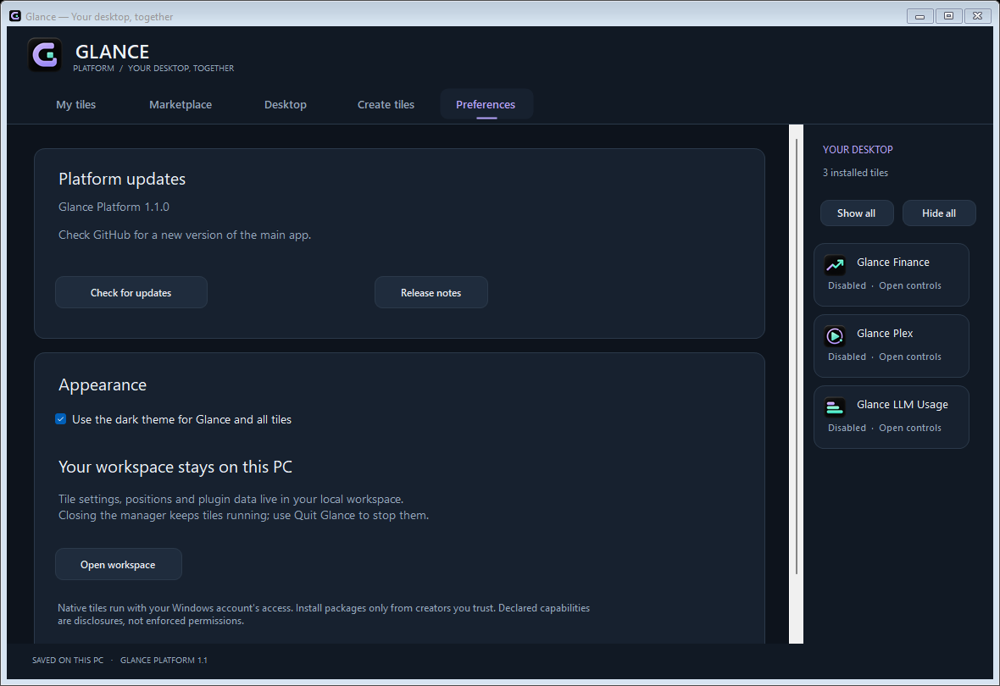
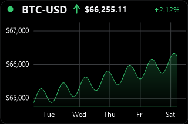
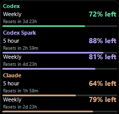
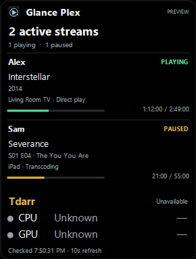
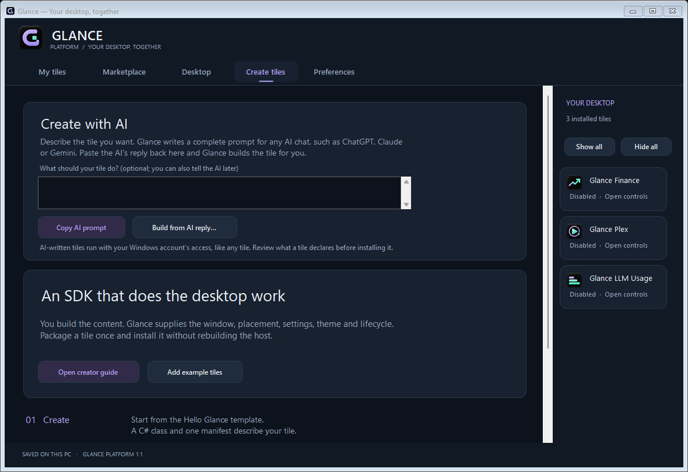
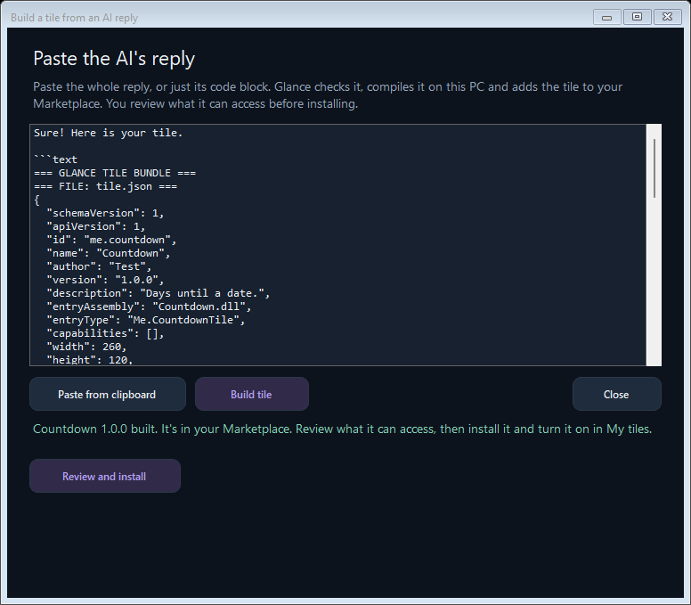

# Glance Platform

One manager for clean, movable desktop tiles.

**[Download Glance Platform 1.1.0](https://github.com/Brusko25/Glance-Platform-Releases/releases/tag/v1.1.0)** · [User guide](USER_GUIDE.md) · [Release notes](CHANGELOG.md)

Glance Platform brings Finance, LLM Usage and Plex into a shared desktop tile system. Tiles keep their original options and run independently. The manager handles installation, placement, the tray and a local Marketplace.

## Get started

1. Download **Glance-Platform-1.1.0-Setup.exe** from the release page.
2. Run setup to install Glance for your Windows account, with a Start menu entry and an optional desktop shortcut.
3. Open Glance and install the tiles you want from Marketplace.

Prefer a portable copy? Download the Windows ZIP, extract the entire folder, and run Start Glance.cmd. Try Glance.cmd opens sample tiles in a separate workspace.

Requires Windows 10/11 and .NET Framework 4.8. The installer and portable ZIP are unsigned. Setup registers Glance in Windows Installed apps / Add or remove programs; uninstall keeps your saved tile data.

## Included

| Tile | Based on |
| --- | --- |
| Finance | Glance Finance 2.6.6 |
| LLM Usage | Glance LLM Usage 2.2.1 |
| Plex | Glance Plex 2.3.0 |
| Clock and Notes | SDK examples |

All three converted tile packages are version 1.1.0. The release includes their .glancetile files, a creator kit in the Windows ZIP, and SHA-256 checksums.

**Preferences → Platform updates** checks GitHub for the main app. **My tiles → Update all installed tiles** installs newer bundled or local catalog packages while preserving settings and positions. Platform updates refresh existing Glance shortcut icons.

Settings opens each tile's familiar options. Minimize tucks the manager into the tray beside the clock. Your account connections and saved tile data stay on your PC.

## Create tiles with AI

Describe the tile you want in **Create tiles → Create with AI** and choose **Copy AI prompt**. Paste it into any AI chat, such as ChatGPT, Claude or Gemini; the prompt tells the AI everything it needs about Glance tiles. Then choose **Build from AI reply…** and paste the answer. Glance compiles it on your PC, checks it and adds it to your Marketplace, where you review what it can access before installing. If the build fails, one click copies the errors back for the AI to fix. AI-written tiles run with your Windows account's access, like any tile.

Marketplace currently browses bundled tiles and a local catalog. Public submissions and online tile hosting are planned. This repository hosts public documentation and release downloads; application implementation is maintained separately.

## Screenshots

The images below show synthetic test data from version 1.1.0.

